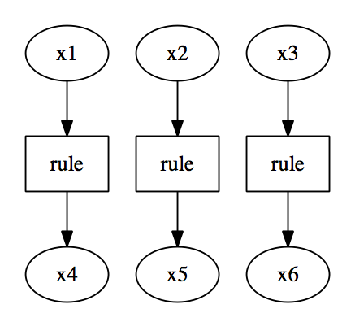

# Ceptre Tutorial: Getting Started

## Overview

Ceptre is a *linear logic programming language* created by [Chris
Martens](http://www.cs.cmu.edu/~cmartens). It can be used to specify evolving
systems with lots of independent parts in a concise way.

Linear logic programming at a glance means writing rules of the form

```
a * b * c -o d * e
```

that specify state transitions on a component-wise basis: this rule says
that if our state contains an `a`, a `b`, and a `c`, then we can replace
that part of the state with `d` and `e`.

This style of programming becomes more useful when we can write *rule
schema* like

```
arm_holding A * clear B -o on A B * clear A * arm_free
```

where `A` and `B` *range over* entities in the world we are simulating. (By
convention, Ceptre uses capital letters as variables that may range over
all appropriately-typed entities.)

In this tutorial, we provide step-by-step instructions for running your
first Ceptre program and learning enough to write your own.  We assume some
familiarity with a Unix-based command line.

## Installing and running Ceptre

Follow the instructions in the [main README file](https://github.com/chrisamaphone/interactive-lp) to build Ceptre. (NOTE: pre-built binaries coming soon.)

Optionally, add Ceptre to your path by editing your shell profile so that
the `PATH` variable includes the `interactive-lp` directory.

Make sure you can run `./ceptre examples/small.cep` from the
`interactive-lp` directory.

*Optionally*, install [GraphViz/Dot](http://www.graphviz.org/) as well.
This will enable you to see visual representations of program output.

If you need help with any of these steps, please contact
[@chrisamaphone](http://www.twitter.com/chrisamaphone) on Twitter.


## Example

### Hello World

The "hello world" example of Ceptre (i.e. the smallest complete, runnable
program with nontrivial behavior)  is a program with two predicates and a
single rule.

Create a file named `hello.cep` and add the following text to it:

```
a : pred.
b : pred.

stage main = { 
  rule : a -o b.
}

#trace _ main {a,a,a}.
```

Then, run `ceptre` on `hello.cep`. You should see something like the following
output:

```
Ceptre!
a: pred.
b: pred.
stage main {
forward chaining rule rule with 0 free variables...
}
#trace ...


Final state:
{qui, b, b, b, (stage main)}

Trace: 
let [x4] = rule  [x1, []];
let [x5] = rule  [x3, []];
let [x6] = rule  [x2, []];
```

(If your `Trace` looks slightly different from this one, don't worry: we'll
see soon why there might be variation in the output.)

This output will not make much sense yet, but for now, the relevant part to
look at is the `Final state`, which we see contains three copies of `b`.
Our rule replaced each instance of `a` provided in the input `{a,a,a}` with
`b`.

### Syntax explained

Let's break down the hello world example into smaller parts that we can
understand one at a time, starting with the bottom line of the program.

#### Trace directive

```
#trace _ main {a,a,a}.
```

This line is what runs the program, via the keyword `#trace`. A `#trace`
command has three arguments: the bound, the initial stage, and the initial
context. A bound of `_` means that the program can run as long as it needs
to; this argument can also be a number specifying the number of steps to
run before stopping. The initial stage `main` tells the program to start in
the stage we've named `main` (more on *stages* later --- for now, just
think of them as program components or subroutines). The initial context
`{a,a,a}` says that the program should start with a context consisting of
three instances of `a`.

#### Rules

```
stage main = { 
  rule : a -o b.
}
```

This syntax declares a stage named `main` consisting of a single rule, named `rule`.
The rule `a -o b`, pronounced `a lolli b`, says that any `a` in the context
can be replaced by a `b`.

In general, a rule may replace multiple components by multiple other
components. Let's look at another rule we could write.

```
rule2 : b * b -o c * d
```

Here we use the `*` syntax to conjoin different components, both prior to
the `-o` and after it. `*` binds more tightly than `-o`: the above rule
would be parenthesized `(b * b) -o (c * c)`.

#### Predicates

```
a : pred.
b : pred.
```

These lines declare `a` and `b` as predicates in the language. All
predicates that rules refer to must be declared beforehand.

Ceptre contains a rich predicate and type language that can be used to
describe data structures like lists, options, and so on. We will describe
these features in the Types and Indexed Predicates section of the tutorial.

## Interactivity

Now, after the declaration of the `main` stage, add the line 
`#interactive main`. That is, the middle part of the program should look
like this:

```
stage main = {
  rule : a -o b.
}
#interactive main.
```

Save the file.  Now when you run `ceptre` on `hello.cep`, you will be given
a prompt:

```
0: rule
1: rule
2: rule
?- 
```

Each of these options corresponds to a different way that the program can
evolve. But we only have one rule in our program, so how can it have
multiple choices for what to do?

The answer is that we started with a context containing *three instances*
of the predicate `a`, and each of those instances is considered distinct.
So there really are three possibilities for how the rule may fire,
corresponding to *which* of the three `a`s is to be replaced.

Type a number corresponding to one of these choices, for instance 0. Now
you should see

```
0: rule
1: rule
2: rule
?- 0

0: rule
1: rule
?-
```

Select 0 twice more to see a similar output to the original program:

```
Final state:
{qui, b, b, b, (stage main)}

Trace: 
let [x4] = rule  [x1, []];
let [x5] = rule  [x2, []];
let [x6] = rule  [x3, []];
```

Now we can make some sense of the `Trace` output: just looking to the
right-hand side of each `=` sign, we see that `rule` is applied to `x1`,
`x1`, and `x3` in sequence. These variables correspond to each of the three
`a`s we began with in the initial context.

The variables `x4`, `x5`, and `x6` on the left-hand side of the `=` are 
*outputs* of the rule application, i.e. they are instances of `b`.

If you have installed GraphViz/Dot, run
```
dot -Tps trace.dot -o trace.ps
```

And open `trace.ps` with your favorite viewer. This graph shows you a
structured record of the program's execution:




## Types and Indexed Predicates

## Multi-stage programs

## Intermediate Features

### Backward-chaining rules

